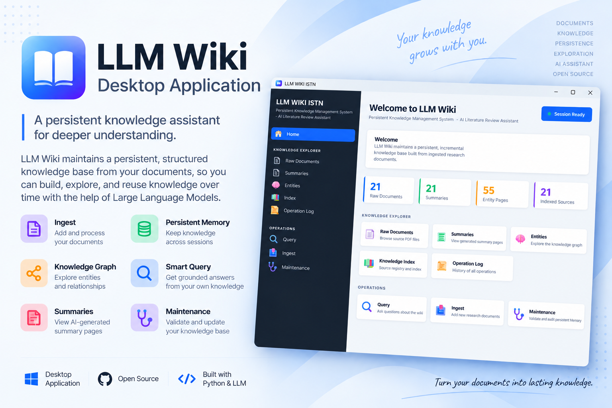
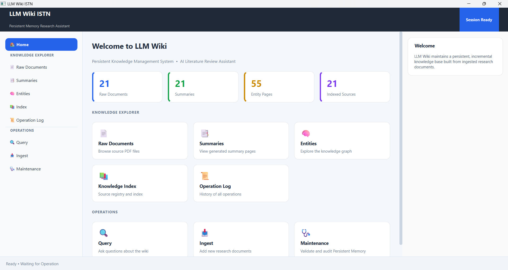
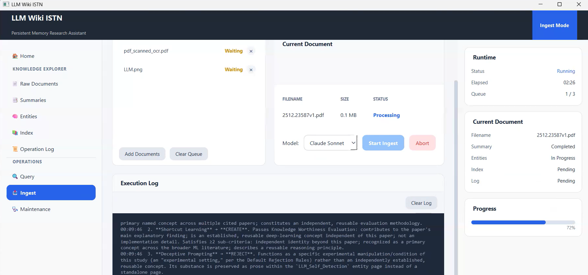
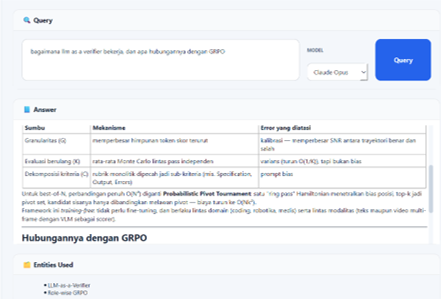
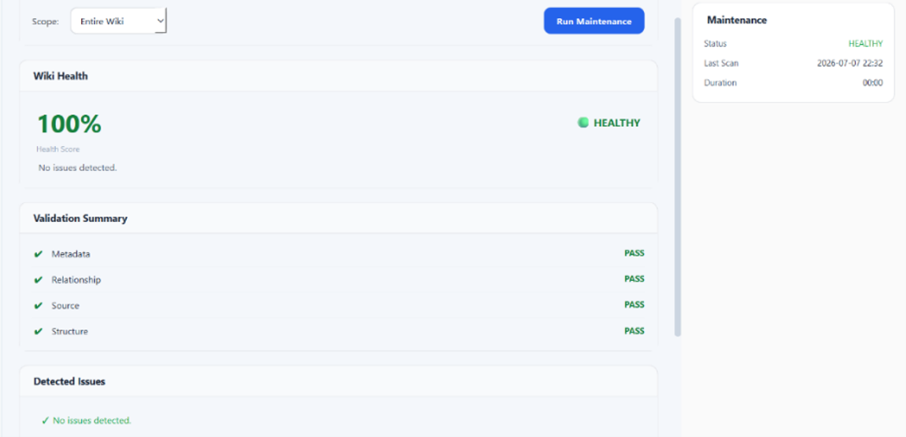
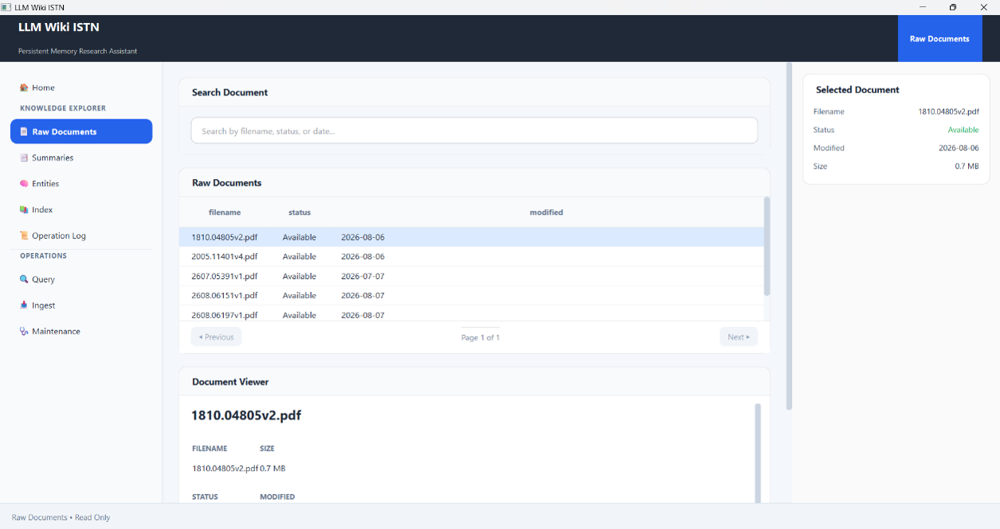
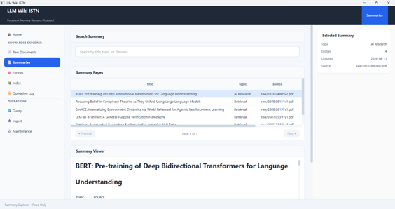
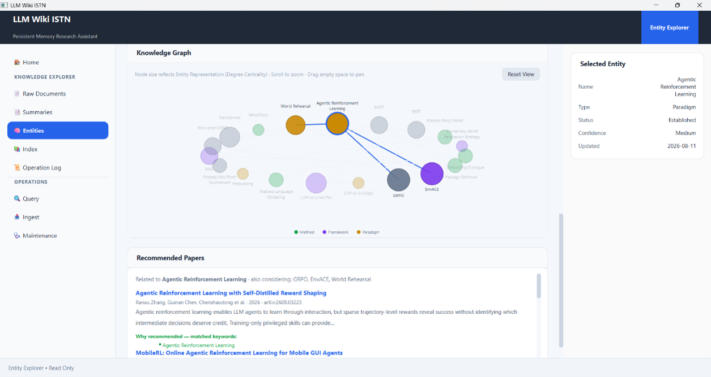
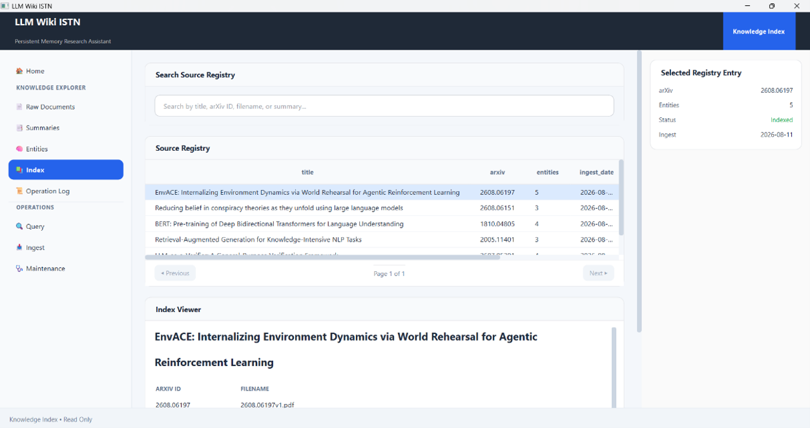
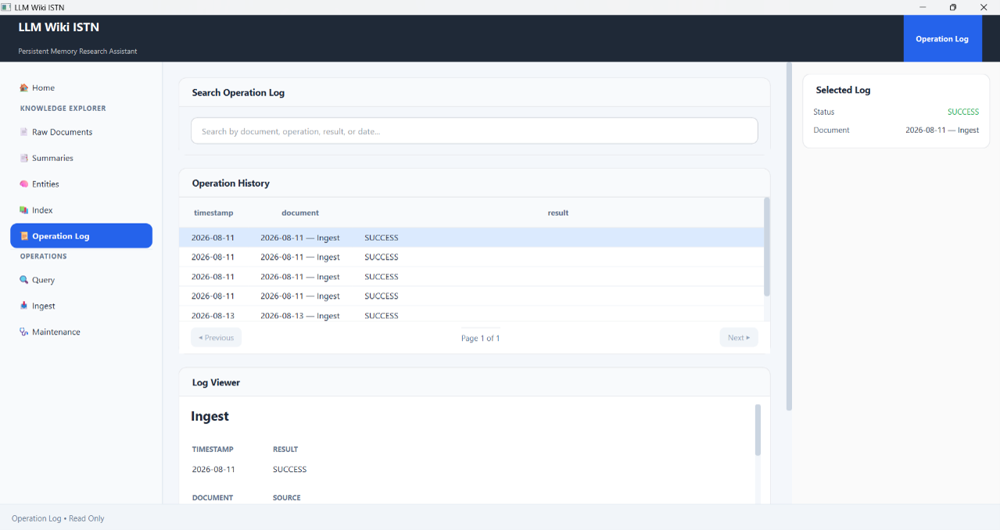

## Download

The latest Windows installer is available in the Releases section.

## Documentation

For detailed instructions on installing and using LLM Wiki Desktop, see the [User Guide](USER_GUIDE.md).

## Demo

Watch the video demonstration of LLM Wiki Desktop on YouTube:

[Watch the Demo on YouTube](https://youtu.be/RrCo1RGOuts?si=BfJk9Bx5tv49JrD9)

## Screenshots

